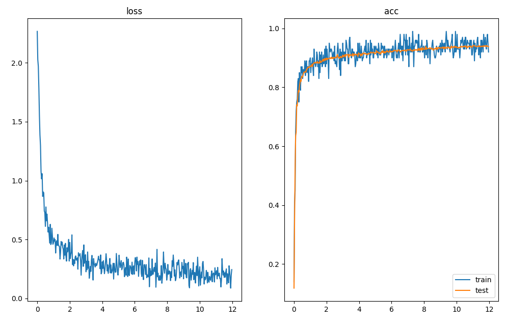
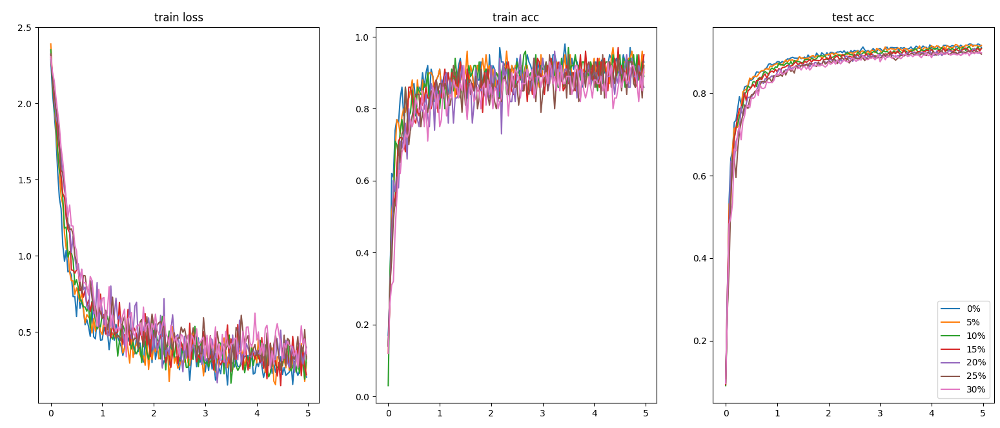
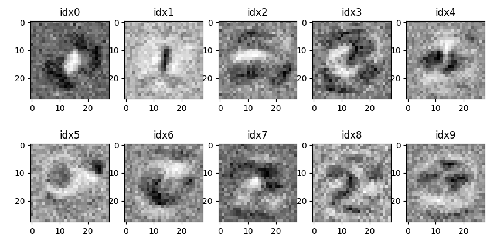

# C++ Neural Network


(ロボットインテリジェンス　課題A)


-  3層以上のフィードフォワード型ニューラルネットとBP学習を行うプログラムを作り5種類以上の10x10画素以上の濃淡画像を識別する実験を行え．
  - 各画素値は0~1の浮動小数に変換して入力する．（無理な人は2値）
- ノイズを加えた場合，性能はどうなるか？ 25％程度まで徐々に増やしてみよ．d%のノイズは，各画素を確率d%でランダム画素値に置き換えれば良い．
- 次に， ノイズ耐性は何に左右されるか考え，実験的に示せ．
-  入力画像はプログラム中に配列で記述しても，ファイルから読み込んでもよい．
-  公開データ可．未指定事項は講義を参考に自分で定め，説明せよ．
-  なお，ニューロン数，結合荷重初期値，学習係数，学習則等について，講義で説明した様々な注意事項や補足事項も十分に考慮せよ．特に中間層のニューロン数と初期値に注意．

-  下記を含め，意欲ある人はやってみよ．（加点する）
  -  中間層のニューロンは何をしているか？各ニューロンの受容野（重みが有意に大きい入力範囲）と最適刺激（出力が最大になる入力パタン）を調べよう．
    -  ヒント：重みベクトルとの内積が最大になる入力ベクトル，それを画像として見てみる．識別能力を維持できる最少ニューロン数のときどうなる？
  -  ニューロン数を増減させて様子を見てみよう．層を増やしてみよう


# 通常時

parameter : 

- 隠れ層：100個
- 重みの初期値：平均0,標準偏差0.1の正規分布
  - Xivierの初期値を用いた
- 学習率：0.1
- 最適化アルゴリズム：ミニバッチSGD（batch size = 100)

```sh
epoch 1 -- 0.14 , 2.26673 , 0.1182 
epoch 2 -- 0.9 , 0.473077 , 0.8729
epoch 3 -- 0.88 , 0.474981 , 0.8935
epoch 4 -- 0.95 , 0.225883 , 0.9093
epoch 5 -- 0.9 , 0.310658 , 0.9147
epoch 6 -- 0.93 , 0.252884 , 0.9145
epoch 7 -- 0.93 , 0.304197 , 0.9201
epoch 8 -- 0.91 , 0.230933 , 0.928
epoch 9 -- 0.93 , 0.193337 , 0.9304
epoch 10 -- 0.95 , 0.16663 , 0.9346
epoch 11 -- 0.93 , 0.268653 , 0.937
epoch 12 -- 0.93 , 0.212946 , 0.9416
```




# ノイズあり
0~30%まで５％ずつノイズを付与する割合を変えながら同じ事を試した。




# ノイズ体制

## 隠れ層の数との関係

## 白色化


# 中間層
重みの可視化




# installation

```sh
$ sudo apt install libomp-14-dev

```
