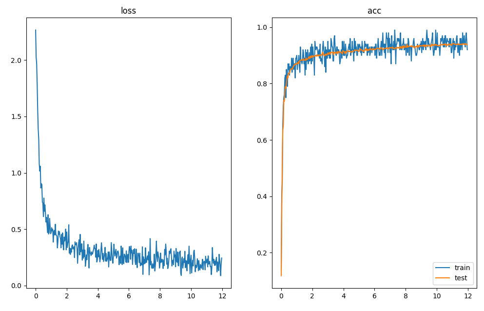

# ロボットインテリジェンス：レポート課題

03220283 西宮直志

課題Aを行いました


## 1.  3層ニューラルネットのMNIST学習

C++を用いて、フィードフォワード型ニューラルネットワークのライブラリを作成し、MNISTの数字識別を行った。

学習時のパラメータは以下のとおりです。

- 隠れ層のニューロン数：100個
- 重みの初期値：平均0,標準偏差0.1の正規分布
  - Xivierの初期値を用いた
- 学習率：0.1
- 最適化アルゴリズム：ミニバッチSGD（batch size = 100)
- 損失関数：交差クロスエントロピー

使用したネットワークは、以下の三層構造である。

- 入力層（出力$28\times28=784$ニューロン）
- 全結合層（出力$100$ニューロン）（活性化関数はSigmoid）
- 全結合層（出力$10$ニューロン）
- Softmax層

実行結果は以下のようになった。

```sh
数字は順番にエポック数、学習データの正解率、学習データ損失、テストデータ正解率です。
epoch 1 -- 0.14 , 2.26673 , 0.1182 
epoch 2 -- 0.9 , 0.473077 | 0.8729
epoch 3 -- 0.88 , 0.474981 , 0.8935
epoch 4 -- 0.95 , 0.225883 , 0.9093
epoch 5 -- 0.9 , 0.310658 , 0.9147
epoch 6 -- 0.93 , 0.252884 , 0.9145
epoch 7 -- 0.93 , 0.304197 , 0.9201
epoch 8 -- 0.91 , 0.230933 , 0.928
epoch 9 -- 0.93 , 0.193337 , 0.9304
epoch 10 -- 0.95 , 0.16663 , 0.9346
epoch 11 -- 0.93 , 0.268653 , 0.937
epoch 12 -- 0.93 , 0.212946 , 0.9416
```

横軸がエポック数、縦軸が正解率または損失関数の値のグラフ：




## 2. ノイズありのデータの学習
教師データの入力データに5~30%のノイズを付与し、上記と同じパラメータで学習させると以下のようになった。

ノイズ量が増えるに連れて学習が遅くなり、特に教師データの正解率と損失関数の値が悪くなっていることが確認できた


## 3. ノイズ耐性について

### 隠れ層との関係

モデルの複雑度が高くなると、ノイズデータも含めて学習してしまい過学習が起きてテストデータの正解率が下がるのではないかと考えた。今回の場合がは中間層のニューロン数が多いと、その分中間層で次元削減する時に余計なノイズデータも取り込んでしまい、本来とは間違った勾配に学習が進んでしまうと考えられるからだ。

- そこで、隠れそうのニューロン数を40〜590個のそれぞれについて、ノイズ（30％）を加えたものと加えなかったものそれぞれのデータで学習させ、テストデ-ータの正解率などを比較した結果、以下のようになった。
- グラフ左の学習データの損失関数についてあまり傾向がつかめないが（これは学習データの場合はバッチとして選ばれた100個のデータのみで損失関数を計算しているため）、右のグラフのテストデータの正解率を見ると、隠れ層のサイズが大きくなると正解率が落ちること、ノイズ耐性が悪くなる（ノイズなしノイズの正解率の差が大きくなる）ことが確認できた。


|隠れ層のニューロン数|教師データの損失関数値（ノイズなし）|教師データの損失関数値（ノイズあり）|教師データ正解率（ノイズなし）|テストデータ正解率（ノイズなし）|テストデータ正解率（ノイズあり）|
| - | - | - | - | - | - |
|40 | 0.16|0.34| 0.96 | 0.90| 0.916|
|90 | 0.25|0.15| 0.96 | 0.96| 0.917|
|140| 0.06|0.31| 1                              | 0.88| 0.901|
|190| 0.20|0.36|  0.94| 0.96| 0.9048|
|240| 0.12|0.23| 0.96 | 0.94| 0.88|
|290| 0.19|0.44|  0.93| 0.88| 0.895|
|340| 0.14|0.19|  0.93| 0.98| 0.892|
|390| 0.18|0.51|  0.93| 0.84| 0.887|
|440| 0.20|0.43|  0.92| 0.84| 0.892|
|490| 0.13|0.34| 0.97 | 0.86| 0.891|
|540| 0.13|0.29| 0.94 | 0.90| 0.882|
|590| 0.15|0.12|  0.92| 0.96| 0.888|


### バッチサイズとの関係

一般的にバッチサイズが大きいほど学習が安定しやすいという特徴があり、ノイズ耐性も同じようにバッチサイズを大きくしたほうがそれぞれのノイズの与える影響が少なくなるので、ランダムにノイズを生成している今回の場合はバッチサイズが大きいほど学習が早く収束するのではないかと考えた。

横軸がバッチサイズ、縦軸が正解率または損失関数のグラフ：


しかし、予想に反してバッチサイズが小さいほど精度がよく、ノイズありとノイズなしの差も小さいという結果となった。


## 4. 中間層について
中間層の重みの可視化を行うと以下のようになった。

特に中央部をよく見ているということを確認できた。

また時にidx1のように、実際のV1視覚野に存在するような方位選択性のあるニューロンも学習によって発生したのが興味深いと感じた


## 層を増やした場合

いくつかのパラメータを試したが、以下のような４層ネットワークで学習を行ったときが最も性能が良かった。

```sh
_________________________________________________
Layer (type)        Output Shape       Param #
=================================================
Affine([ 784, 256 ])     256      200960
ReLu([ 0, 0 ])           0        0
Affine([ 256, 128 ])     128      32896
ReLu([ 0, 0 ])           0        0
Affine([ 128, 64 ])      64       8256
ReLu([ 0, 0 ])           0        0
Affine([ 64, 10 ])       10       650
Softmax(10)              10       0
=================================================
Total params : 242762
Trainable params : 242762
Non-Trainable params : 0
_________________________________________________

```

以下のような結果になった。

```sh
数字は順番にエポック数、学習データの正解率、学習データ損失、テストデータ正解率です。

epoch 1 -- 0.11 , 2.3768 , 0.109,
epoch 2 -- 0.9 , 0.253019 , 0.9266, 
epoch 3 -- 0.975 , 0.126711 , 0.9479, 
epoch 4 -- 0.985 , 0.0756529 , 0.961,
epoch 5 -- 0.98 , 0.0944717 , 0.9668,
epoch 6 -- 0.975 , 0.087978 , 0.9702, 
epoch 7 -- 0.995 , 0.0322522 , 0.9733,
epoch 8 -- 1 , 0.0178734 , 0.9755, 
epoch 9 -- 1 , 0.0257465 , 0.9808, 
epoch 10 -- 0.995 , 0.033733 , 0.9829, 
epoch 11 -- 0.995 , 0.0938527 , 0.9863,
epoch 12 -- 1 , 0.0155537 , 0.9879, 
```


