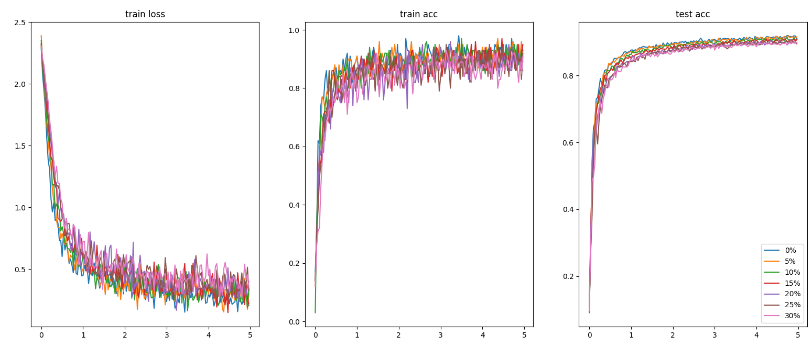
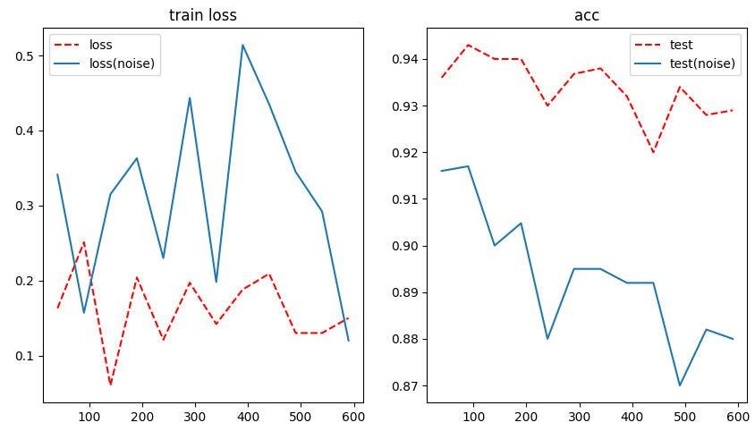

# ロボットインテリジェンス：レポート課題

03220283 西宮直志

課題Aを行いました


## 1.  3層ニューラルネットのMNIST学習

C++を用いて、フィードフォワード型ニューラルネットワークのライブラリを作成し、MNISTの数字識別を行った。

学習時のパラメータは以下のとおりです。

- 隠れ層のニューロン数：100個
- 重みの初期値：平均0,標準偏差0.1の正規分布
  - Xivierの初期値を用いた
- 学習率：0.1
- 最適化アルゴリズム：ミニバッチSGD（batch size = 100)
- 損失関数：交差クロスエントロピー

使用したネットワークは、以下の三層構造である。

- 入力層（出力$28\times28=784$ニューロン）
- 全結合層（出力$100$ニューロン）（活性化関数はSigmoid）
- 全結合層（出力$10$ニューロン）
- Softmax層

実行結果は以下のようになった。

```sh
数字は順番にエポック数、学習データの正解率、学習データ損失、テストデータ正解率です。
epoch 1 -- 0.14 , 2.26673 , 0.1182 
epoch 2 -- 0.9 , 0.473077 , 0.8729
epoch 3 -- 0.88 , 0.474981 , 0.8935
epoch 4 -- 0.95 , 0.225883 , 0.9093
epoch 5 -- 0.9 , 0.310658 , 0.9147
epoch 6 -- 0.93 , 0.252884 , 0.9145
epoch 7 -- 0.93 , 0.304197 , 0.9201
epoch 8 -- 0.91 , 0.230933 , 0.928
epoch 9 -- 0.93 , 0.193337 , 0.9304
epoch 10 -- 0.95 , 0.16663 , 0.9346
epoch 11 -- 0.93 , 0.268653 , 0.937
epoch 12 -- 0.93 , 0.212946 , 0.9416
```

横軸がエポック数、縦軸が正解率または損失関数の値のグラフ：


## 2. ノイズありのデータの学習
教師データの入力データに5~30%のノイズを付与し、上記と同じパラメータで学習させると以下のようになった。

ノイズ量が増えるに連れて学習が遅くなり、特に教師データの正解率と損失関数の値が悪くなっていることが確認できた



## 3. ノイズ耐性について

### 隠れ層との関係

モデルの複雑度が高くなると、ノイズデータも含めて学習してしまい過学習が起きてテストデータの正解率が下がるのではないかと考えました。今回の場合がは中間層のニューロン数が多いと、その分中間層で次元削減する時に余計なノイズデータも取り込んでしまい、本来とは間違った勾配に学習が進んでしまうと考えられるからです。




```
epoch 2 0%, 40 >>       0.88 , 0.599828 , 0.851, 4.08272 
epoch 3 0%, 40 >>       0.92 , 0.345713 , 0.8902, 5.11787        
epoch 4 0%, 40 >>       0.9 , 0.430707 , 0.9044, 5.78669   
epoch 5 0%, 40 >>       0.91 , 0.271947 , 0.9129, 6.14871   
epoch 6 0%, 40 >>       0.93 , 0.236277 , 0.9173, 6.26625  
epoch 7 0%, 40 >>       0.92 , 0.278611 , 0.9277, 6.50013       
epoch 8 0%, 40 >>       0.89 , 0.355286 , 0.9277, 6.64978  
 iter per epoch600       
epoch 1 30%, 40 >>      0.1 , 2.39278 , 0.0816, 2.34369
epoch 2 30%, 40 >>      0.69 , 1.03824 , 0.7798, 4.13866     
epoch 3 30%, 40 >>      0.91 , 0.488086 , 0.8543, 5.5155    
epoch 4 30%, 40 >>      0.9 , 0.415432 , 0.8704, 6.29584
epoch 5 30%, 40 >>      0.91 , 0.395319 , 0.8802, 6.66439
epoch 6 30%, 40 >>      0.88 , 0.448605 , 0.8879, 6.8993
epoch 7 30%, 40 >>      0.81 , 0.479374 , 0.8895, 7.29396
epoch 8 30%, 40 >>      0.89 , 0.398304 , 0.8988, 7.10933                                                                                                                                     
 iter per epoch600                                                                                                                                                                            
epoch 1 0%, 80 >>       0.1 , 2.33053 , 0.0911, 2.35536 
epoch 2 0%, 80 >>       0.9 , 0.432955 , 0.8689, 4.52904
epoch 3 0%, 80 >>       0.96 , 0.222128 , 0.8877, 5.68148
epoch 4 0%, 80 >>       0.9 , 0.372812 , 0.9055, 6.21774
epoch 5 0%, 80 >>       0.95 , 0.249676 , 0.9117, 6.61821
epoch 6 0%, 80 >>       0.92 , 0.35038 , 0.9166, 6.96493
epoch 7 0%, 80 >>       0.92 , 0.328843 , 0.9235, 7.23061
epoch 8 0%, 80 >>       0.92 , 0.28331 , 0.9264, 7.19717

 iter per epoch600
epoch 1 30%, 80 >>      0.12 , 2.3263 , 0.1038, 2.3158
epoch 2 30%, 80 >>      0.87 , 0.616479 , 0.8311, 4.79158
epoch 3 30%, 80 >>      0.87 , 0.543697 , 0.8638, 6.33034
epoch 4 30%, 80 >>      0.89 , 0.350792 , 0.8841, 6.97594
epoch 5 30%, 80 >>      0.89 , 0.387587 , 0.8945, 7.52011
epoch 6 30%, 80 >>      0.86 , 0.392777 , 0.8946, 7.65419
epoch 7 30%, 80 >>      0.85 , 0.386829 , 0.8966, 8.00833
epoch 8 30%, 80 >>      0.92 , 0.273675 , 0.905, 8.1016
 iter per epoch600
epoch 1 0%, 120 >>      0.17 , 2.24642 , 0.1086, 2.30069
epoch 2 0%, 120 >>      0.87 , 0.544609 , 0.8751, 4.75294
epoch 3 0%, 120 >>      0.94 , 0.296996 , 0.8919, 5.90941
epoch 4 0%, 120 >>      0.91 , 0.398938 , 0.901, 6.39596
epoch 5 0%, 120 >>      0.98 , 0.211647 , 0.9149, 6.85403
epoch 6 0%, 120 >>      0.92 , 0.253742 , 0.9188, 7.04537
epoch 7 0%, 120 >>      0.92 , 0.219207 , 0.9238, 6.99523
epoch 8 0%, 120 >>      0.93 , 0.270531 , 0.9276, 7.69991
 iter per epoch600
epoch 1 30%, 120 >>     0.08 , 2.35044 , 0.0368, 2.36177
epoch 2 30%, 120 >>     0.82 , 0.68349 , 0.8263, 5.04314
epoch 3 30%, 120 >>     0.88 , 0.428517 , 0.8749, 6.68059
epoch 4 30%, 120 >>     0.93 , 0.327143 , 0.8772, 7.37639
epoch 5 30%, 120 >>     0.85 , 0.485077 , 0.8977, 7.70413
epoch 6 30%, 120 >>     0.84 , 0.527146 , 0.9001, 8.08641
epoch 7 30%, 120 >>     0.91 , 0.339869 , 0.9105, 8.47791
epoch 8 30%, 120 >>     0.89 , 0.359101 , 0.9056, 8.65996
 iter per epoch600
epoch 1 0%, 160 >>      0.11 , 2.30839 , 0.075, 2.31317
epoch 2 0%, 160 >>      0.93 , 0.342699 , 0.8758, 5.08277
epoch 3 0%, 160 >>      0.84 , 0.556614 , 0.8942, 6.00985
epoch 4 0%, 160 >>      0.92 , 0.314268 , 0.9065, 6.54509
epoch 5 0%, 160 >>      0.89 , 0.355142 , 0.9091, 7.12109
epoch 6 0%, 160 >>      0.9 , 0.337326 , 0.9133, 7.29497
epoch 7 0%, 160 >>      0.93 , 0.237007 , 0.9191, 7.27551
epoch 8 0%, 160 >>      0.89 , 0.357705 , 0.9222, 7.6652
 iter per epoch600
epoch 1 30%, 160 >>     0.14 , 2.32748 , 0.1535, 2.33483
epoch 2 30%, 160 >>     0.8 , 0.81124 , 0.8468, 5.28687
epoch 3 30%, 160 >>     0.86 , 0.53565 , 0.8718, 6.98491
epoch 4 30%, 160 >>     0.87 , 0.496353 , 0.8862, 7.49937
epoch 5 30%, 160 >>     0.88 , 0.36791 , 0.8909, 8.00192
epoch 6 30%, 160 >>     0.9 , 0.349442 , 0.9014, 8.50764
epoch 7 30%, 160 >>     0.89 , 0.276351 , 0.8991, 8.61741
epoch 8 30%, 160 >>     0.87 , 0.509482 , 0.9052, 8.67829
 iter per epoch600                                                                                                                                 
epoch 1 0%, 200 >>      0.14 , 2.28703 , 0.1055, 2.31293
epoch 2 0%, 200 >>      0.91 , 0.464657 , 0.8773, 5.12722
epoch 3 0%, 200 >>      0.88 , 0.40652 , 0.8984, 5.99688
epoch 4 0%, 200 >>      0.93 , 0.3754 , 0.9041, 6.7237
epoch 5 0%, 200 >>      0.89 , 0.310325 , 0.9124, 7.35156
epoch 6 0%, 200 >>      0.9 , 0.311465 , 0.9121, 7.50646
epoch 7 0%, 200 >>      0.89 , 0.424903 , 0.9198, 7.70734
epoch 8 0%, 200 >>      0.95 , 0.182523 , 0.9253, 7.67147
 iter per epoch600
epoch 1 30%, 200 >>     0.18 , 2.26287 , 0.1461, 2.28169
epoch 2 30%, 200 >>     0.89 , 0.519982 , 0.8467, 5.39368
epoch 3 30%, 200 >>     0.85 , 0.592209 , 0.8728, 7.02794
epoch 4 30%, 200 >>     0.85 , 0.43127 , 0.8881, 7.76619
epoch 5 30%, 200 >>     0.91 , 0.30313 , 0.891, 8.17805
epoch 6 30%, 200 >>     0.85 , 0.480405 , 0.8951, 8.42739
epoch 7 30%, 200 >>     0.92 , 0.359328 , 0.8982, 8.73783
epoch 8 30%, 200 >>     0.88 , 0.265396 , 0.8989, 8.8702
 iter per epoch600
epoch 1 0%, 240 >>      0.14 , 2.25872 , 0.1126, 2.27798
epoch 2 0%, 240 >>      0.89 , 0.452201 , 0.8846, 5.10603
epoch 3 0%, 240 >>      0.92 , 0.253234 , 0.8953, 5.97085
epoch 4 0%, 240 >>      0.9 , 0.365744 , 0.9042, 6.62811
epoch 5 0%, 240 >>      0.91 , 0.208265 , 0.913, 7.26434
epoch 6 0%, 240 >>      0.85 , 0.382469 , 0.9169, 7.3178
epoch 7 0%, 240 >>      0.92 , 0.302492 , 0.9195, 7.49371
epoch 8 0%, 240 >>      0.94 , 0.219651 , 0.924, 7.82805
 iter per epoch600
epoch 1 30%, 240 >>     0.1 , 2.2761 , 0.117, 2.30042
epoch 2 30%, 240 >>     0.9 , 0.496993 , 0.8505, 5.68716
epoch 3 30%, 240 >>     0.88 , 0.468087 , 0.8846, 7.32395
epoch 4 30%, 240 >>     0.93 , 0.307629 , 0.8886, 7.93259
epoch 5 30%, 240 >>     0.9 , 0.322457 , 0.8978, 8.15539
epoch 6 30%, 240 >>     0.87 , 0.29862 , 0.8963, 8.65176
epoch 7 30%, 240 >>     0.92 , 0.282855 , 0.9002, 8.69647
epoch 8 30%, 240 >>     0.91 , 0.335419 , 0.8937, 9.16278
```

### バッチサイズとの関係

一般的にバッチサイズが大きいほど学習が安定しやすいという特徴があり、ノイズ耐性も同じようにバッチサイズを大きくしたほうがそれぞれのノイズの与える影響が少なくなるので、ランダムにノイズを生成している今回の場合はバッチサイズが大きいほど学習が早く収束するのではないかと考えた。

横軸がバッチサイズ、縦軸が正解率または損失関数のグラフ：


しかし、予想に反してバッチサイズが小さいほど精度がよく、ノイズありとノイズなしの差も小さいという結果となった。これは、


## 4. 中間層について
中間層の重みの可視化を行うと以下のようになった。

特に中央部をよく見ているということを確認できた。

また時にidx1のように、実際のV1視覚野に存在するような方位選択性のあるニューロンも学習によって発生したのが興味深いと感じた


## 層を増やした場合

いくつかのパラメータを試したが、以下のような４層ネットワークで学習を行ったときが最も性能が良かった。

```sh
_________________________________________________
Layer (type)        Output Shape       Param #
=================================================
Affine([ 784, 256 ])     256      200960
ReLu([ 0, 0 ])           0        0
Affine([ 256, 128 ])     128      32896
ReLu([ 0, 0 ])           0        0
Affine([ 128, 64 ])      64       8256
ReLu([ 0, 0 ])           0        0
Affine([ 64, 10 ])       10       650
Softmax(10)              10       0
=================================================
Total params : 242762
Trainable params : 242762
Non-Trainable params : 0
_________________________________________________

```

以下のような結果になった。

```sh
数字は順番にエポック数、学習データの正解率、学習データ損失、テストデータ正解率です。

epoch 1 -- 0.11 , 2.3768 , 0.109,
epoch 2 -- 0.9 , 0.253019 , 0.9266, 
epoch 3 -- 0.975 , 0.126711 , 0.9479, 
epoch 4 -- 0.985 , 0.0756529 , 0.961,
epoch 5 -- 0.98 , 0.0944717 , 0.9668,
epoch 6 -- 0.975 , 0.087978 , 0.9702, 
epoch 7 -- 0.995 , 0.0322522 , 0.9733,
epoch 8 -- 1 , 0.0178734 , 0.9755, 
epoch 9 -- 1 , 0.0257465 , 0.9808, 
epoch 10 -- 0.995 , 0.033733 , 0.9829, 
epoch 11 -- 0.995 , 0.0938527 , 0.9863,
epoch 12 -- 1 , 0.0155537 , 0.9879, 
```


